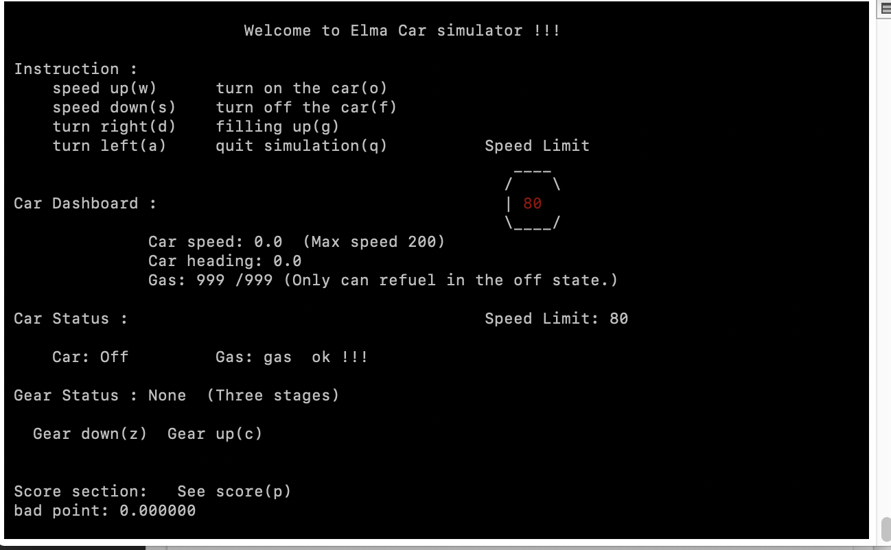
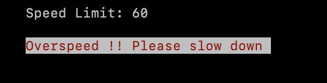
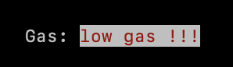
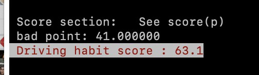
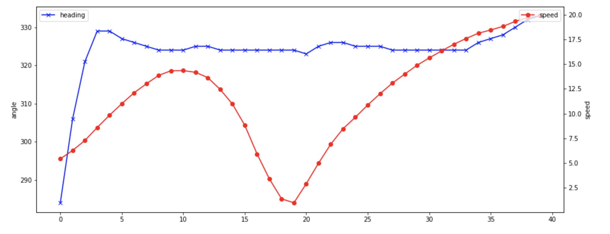
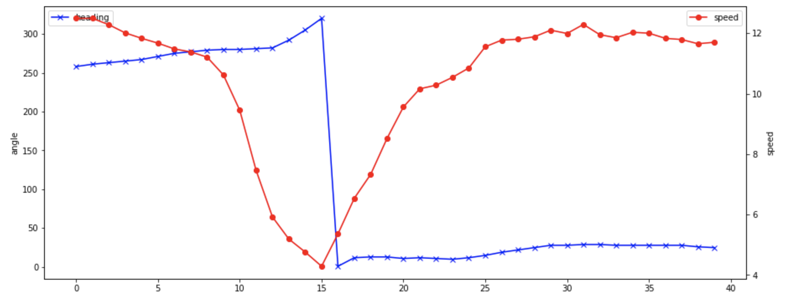

# Car-driving-simulator

## Project goals :


Users can simulate real driving conditions through the car driving simulator. The user interface will generate a random speed limit, and the driver must follow the speed limit to adjust the car speed.
The user interface will display information to the user such as speed, car heading angle, oil volume, and gear state.
When the simulation is finished, the system will score the driver according to the driving process.
Overspeed, unnormal turning speed, improper gear shift will reduce the score.
Finally, the driving process will be recorded as a JSON file for later analysis.

------

## Project Architecture :

- Simulation to use a more realistic simulation of a car's velocity and angle
    * Use PID controller to contol the Car speed and angle.
    * Set criteria to prevent the car from rotating too far or the acceleration is too fast.

- Add some changes in the state of the car by the instructions sent by the driver.
    * Trun on/off : Launch the car or turn off the car
    * Speed up/down : User can adjust the car speed 
    * Turn right/left : User can adjust the car heading angle (Car heading angle is based on polar coordinate）
    * Filling up the gas : Automatically fill up the gas
    * See score : Display the score based on the driving process.
    * Quit : Shut down the simulator and generate the JSON file 

------

## User Operation guide :

- Interface :




- Operation rule :

    * Refuel gas : Only refuel the gas in the off state.
    * Car gear : 
        - Gear position 1 : Maximum torque, Speed limit : 50
        - Gear position 2 : Medium torque, Speed limit : 100
        - Gear position 3 : Minimum torque, Speed limit :200
    * User must adjust the speed according to the speed limit flag displayed on the interface. If the speed exceeds the limit, the warning will jump out and the driver score will be deducted.
         
    * "Low gas" warning will jump out when the gas is lower than 200
         
    * If user does not decelerate while turning the heading angle the drivwer score will be deducted.

- Instruction Set :
    - **o** : Turn on the car
    - **f** : Turn off the car
    - **w** : Speed up
    - **s** : Speed down
    - **a** : Turn left
    - **d** : Turn right
    - **g** : Refuel the gas
    - **c** : Gear up
    - **z** : Gear down
    - **p** : View score
    - **q** : Quit the simulator
    
## Installation :

To install the car simulator, type
 ```
   git clone https://github.com/GaryWu0512/Car_driving_simulator.git
   cd Car_driving_simulator
   docker run -v $PWD:/source -it klavins/elma:latest bash
   make
 ```
 
## Execution :

To run the stopwatch, type

    bin/carsimulator

## Result : 
- Driver score based on driving process:



- Driving process record JSON file analysis in Python Jupyter:


**Accelerate**



**Turning left**


**U turn**




## References

[elma](https://github.com/klavinslab/elma)

